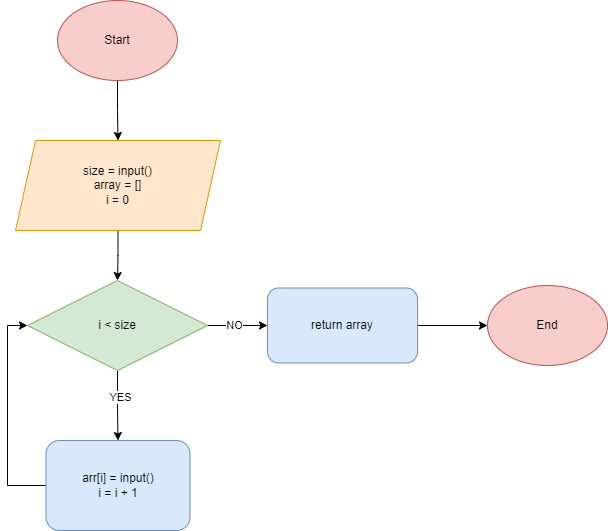
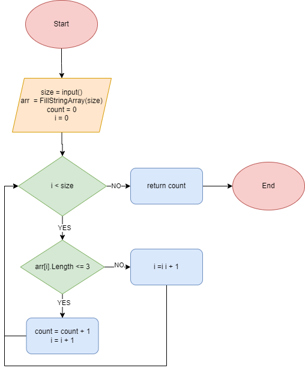
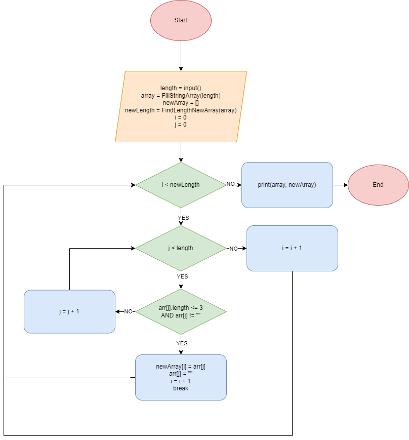

# Итоговая контрольная работа по основному блоку

### Задание: 
Написать программу, которая из имеющегося массива строк формирует новый массив из строк, длина которых меньше, либо равна 3 символам. Первоначальный массив можно ввести с клавиатуры, либо задать на старте выполнения алгоритма. При решении не рекомендуется пользоваться коллекциями, лучше обойтись исключительно массивами.
### Примеры:
[“Hello”, “2”, “world”, “:-)”] → [“2”, “:-)”]
[“1234”, “1567”, “-2”, “computer science”] → [“-2”]
[“Russia”, “Denmark”, “Kazan”] → []
### Пошаговое решение:
1. В начале принимаем через консольный ввод данных длинну массива.
2. Заполняем массив значениями через консольный ввод данных в функции FillStringArray.

3. Вызываем функцию CreateNewArray.
4. В функции выше вызывается функция FindLengthNewArray, которая определяет длина нового массива. Она перебирает элементы в оригинальном массиве и ищет элементы соотвествующие тексту задания. При нахождении таковых увеличивает счетчик(count) который передается этой функцией в конце, определяя длинну нового массива.

5. Вновь возвразщаемся в функцию CreateNewArray. Здесь начинается перебор нового массива, с вложенным перебором старого на каждой итерации первого. Вложенный цикл проверяет элементы старого массива на соответствие тексту задания и добавляет этот элемент в новый массив, при это он стирает его из старого, чтобы не добавить повторно.

6. Выводим результат.

